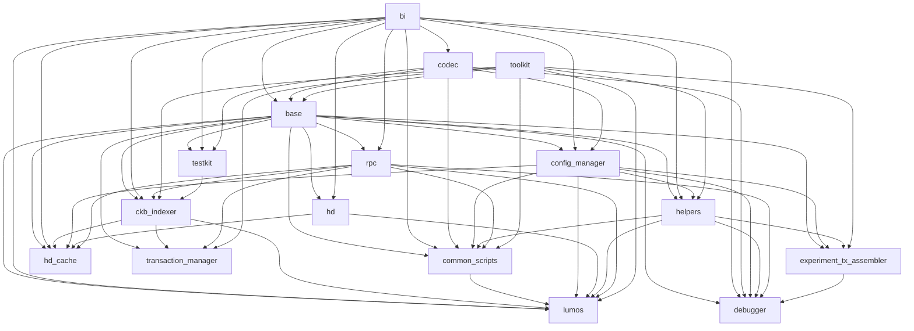

# Lumos

Helps you build CKB-based dApps

---

## Features

- Transfer CKB/sUDT, DAO operation
- Test, deploy, upgrade contract
- HD wallet
- Works in the browser or NodeJS
- Gadgets such as address convertor, deserialization

---

## At a Glance

```js
txSkeleton = transfer(txSkeleton, [ALICE_ADDRESS], BOB_ADDRESS, 100e8);
txSkeleton = payFeeByFeeRate(txSkeleton, [ALICE_ADDRESS], 1000);
txSkeleton = prepareSigningEntries(txSkeleton);
signatures = entries.map((entry) => signRecoverable(entry.message, ALICE_PRIVATE_KEY));
signedTx = helpers.sealTransaction(txSkeleton, signatures);
sendTransaction(signedTx);
```

---

## Structure

```
├── examples
├── packages
├── website
├── babel.config.js
├── lerna.json
├── package.json
├── tsconfig.json
└── yarn.lock
```

<!--

- Lumos is organized as a monorepo, modules are under `/packages`
- There are various examples under `/examples`, which can generally be run in the browser
- `website` provides docs and gadgets that you can use out of the box
-->

---

## Packages

Lumos is organized as a monorepo



<!--

some commonly used modules:

- common-scripts: build common transactions, such as transferring CKB or sUDT
- codec: serialization and deserialization, works with molecule
- config-manager: Manage script config required in dApp
- ckb-indexer: collect UTxOs
- hd: HD wallet/keys
-->

---

## History

|          | Before        | Current         |
| -------- | ------------- | --------------- |
| Runtime  | NodeJS        | NodeJS +Browser |
| Indexer  | Lumos Indexer | CKB Indexer     |
| Molecule | Codegen       | Binding         |

---

## Send My First Transaction

<!--

`/tutorial`

-->

---

## Next Step

- More friendly documentation and example
- Provider with friendly API
- Common wallet integration
- Support open transaction
- More friendly plugin system

---

## Any Question?

- Open An Issue on [Lumos](https://github.com/ckb-js/lumos/issues)
- Or [Contract Me](mailto://homura.dev@gmail.com)

---

## Practices

- Transfer CKB via Omnilock and MetaMask
- Transfer CKB or sUDT to multiple locks
- [Build A tx to exchange sudt for CKB](https://github.com/nervosnetwork/ckit/issues/108)
